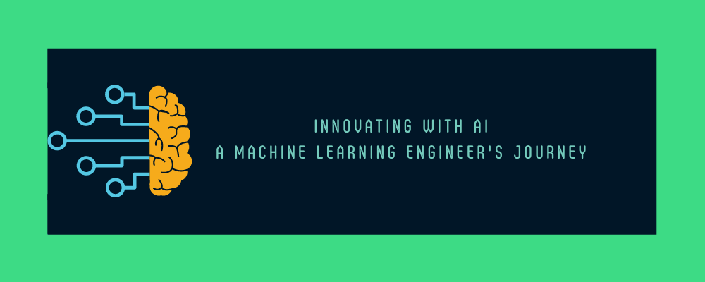

  

# Hi there 👋, I'm Isharab Ahmed
## I am Machine Learning Engineer

I am a skilled Machine Learning Engineer with expertise in Python, TensorFlow, PyTorch, Computer Vision, and NLP. I have a deep understanding of Machine Learning algorithms and the ability to develop innovative solutions using my knowledge. As a Machine Learning Engineer, I enjoy creating intelligent systems that can understand and learn from complex data. My goal is to develop models that can provide valuable insights and drive business decisions. I am constantly staying up-to-date with the latest trends in the field and am always seeking new challenges and opportunities to apply my skills. My passion for Machine Learning and commitment to excellence is evident in the work I produce. I pride myself on staying organized, meeting deadlines, and delivering exceptional results. Overall, my expertise, dedication, and creativity make me a highly skilled and successful Machine Learning Engineer.

Skills:
* 🐍 PYTHON 
* 😍 PYTORCH 
* 😊 TENSORFLOW 
* 📷 COMPUTER VISION 
* 💬 Natural Language Processing 
* 🤗 HUGGINGFACE
* 🖥️ MLOPS

            

     

  

  

  
